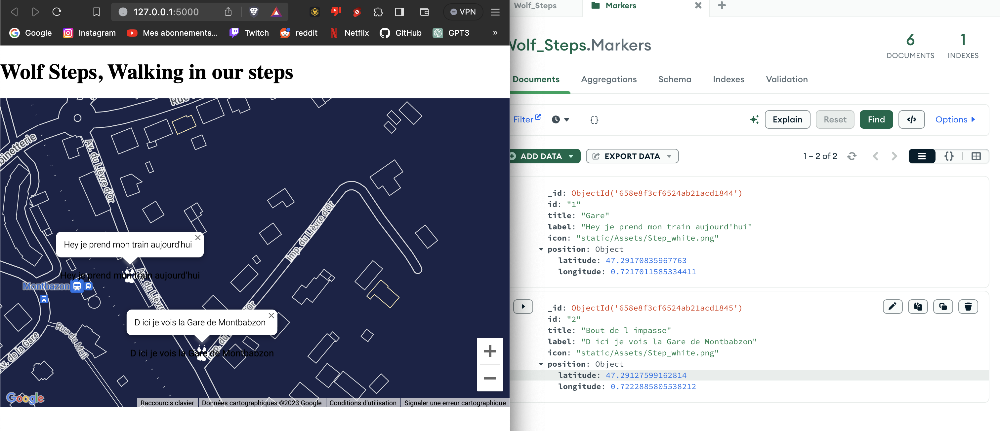
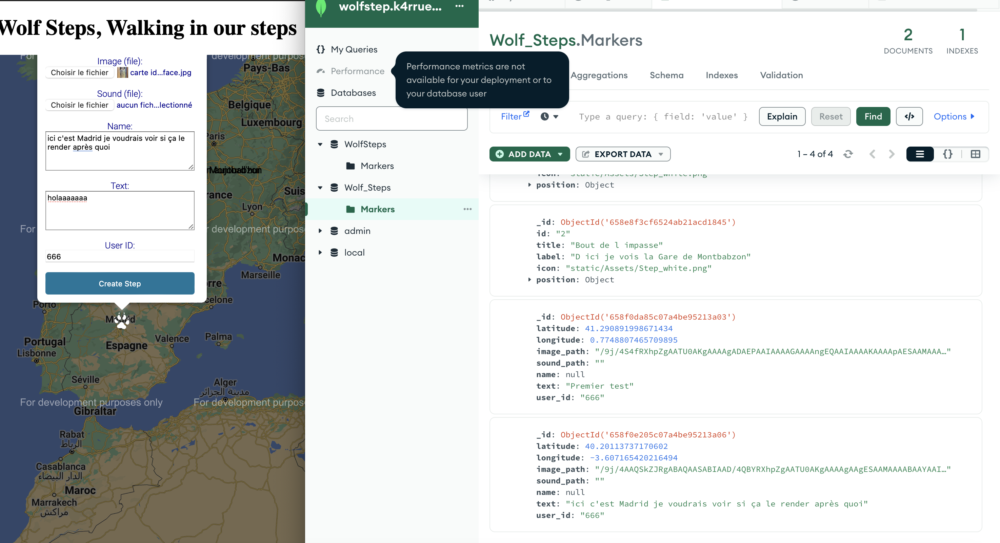

# WOLF STEPS

 - This app purpose is to create a kind of social media that goes with along your trips balades.

- Basically this would be a nicer version of GoogleMaps but more axed on the content creation/reaction

- Adding some Gamification both for improving the experience and rewrading the user.
--------------------------------------

##### TO DO 

- [ ] MVP interface of map
    - [x] connection to googlemap API + printing frontend 
    - [x] adding markers + content 
    - [x] set current place to actual geolocalisation
    - [x] rewrite the all stuff in python so I understand the backend lol
    - [x] create a frontend interface for markers
    - [x] center the map to the current user localisation
    - [x] python backend to create the marker based on your localisation (200m around max)

    
    - [ ] frontend way to interact with markers : reply, share, like ....
    - [ ] login module to implement
    - [ ] backend  profile creation
    - [ ] profile page 
    - [ ] Wolf pixelArt creator --> to create your wolf avatar
    - [ ] Customization for your Wolf Steps

- [x]  Database to store content en geolocalisation
    - [x] choosing type of db --> MongoDB
    - [x] creating Marker creator in Python that stores the Markers in MongoDB
- [x]  Connecting the frontend and the backend

